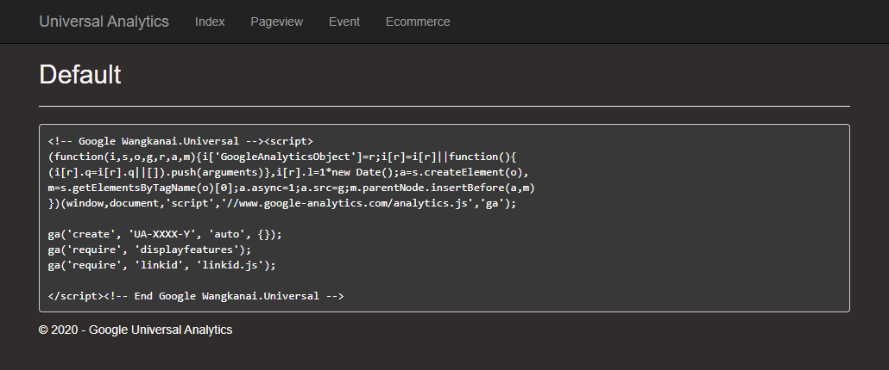

## Google Universal Analytics

[](https://www.nuget.org/packages/Wangkanai.Universal/)

### What is Google Universal Analytics?
Wangkanai Analytics is a [.NET Framework](https://docs.microsoft.com/en-gb/aspnet/overview) lightweight server-side code that generator library that JavaScript client-side on the fly for [Google Analytics **analytics.js**](https://developers.google.com/analytics/devguides/collection/analyticsjs/). The goal of the framework is to stay out of the way as much as possible and provide a super interaction with Google all from C#.

#### How do i use it?

This project provide the full source code and complied dll library for you to add reference into your visual studio projects. The library include Intellisense to help guide you write server-side code in an effective manner.

```csharp

```

### Features


### Demo



#### Official Plugins extensions
- [Display Features](https://developers.google.com/analytics/devguides/collection/analyticsjs/display-features)
- [Enhanced link attribution](https://developers.google.com/analytics/devguides/collection/analyticsjs/enhanced-link-attribution)
- [Linker](https://developers.google.com/analytics/devguides/collection/analyticsjs/linker)


#### Where it originated from?
This original library that was introduced in [CodePlex](https://archive.codeplex.com/?p=universalanalytics). The library was for .NET Framework web application to render **analytics.js** javascript client-side to interact with Google API from .NET language web application within the server-side code environment. Both ASP.NET WebForm and ASP.NET MVC. Its was good, but we would like to see a much more extensible and ambust platform, so we are rewriting the entire framework.

#### How do i contribute?
Universal Analytics is a powerful and continuous improving platform. We would like to invite developers to help maintain and add features so that this library is keep aligned with most of the popular web analytics out there. 


